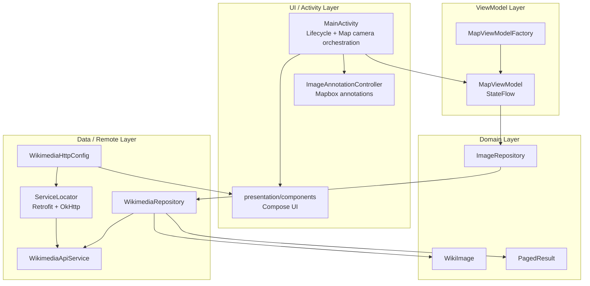
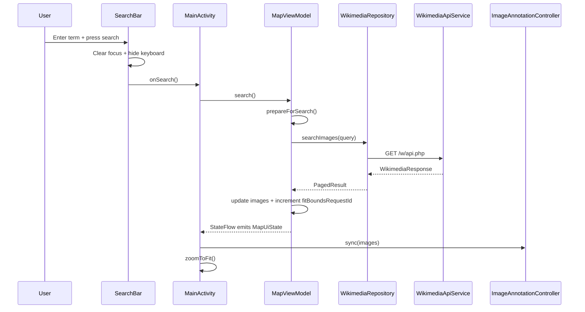
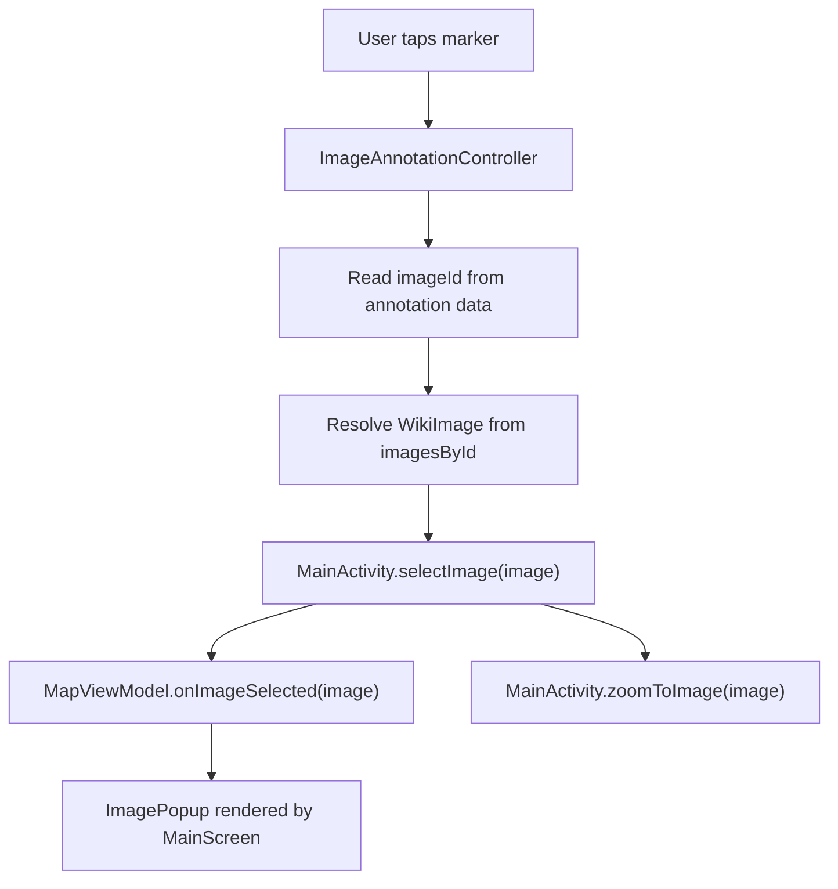
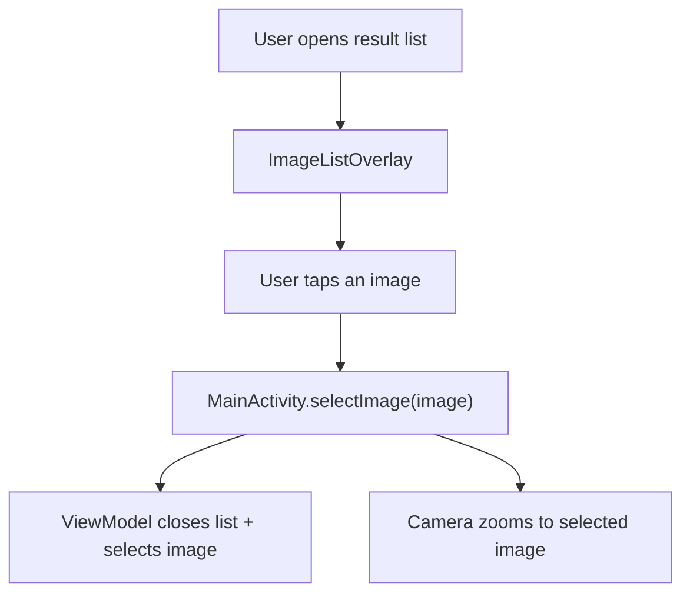
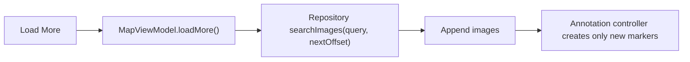
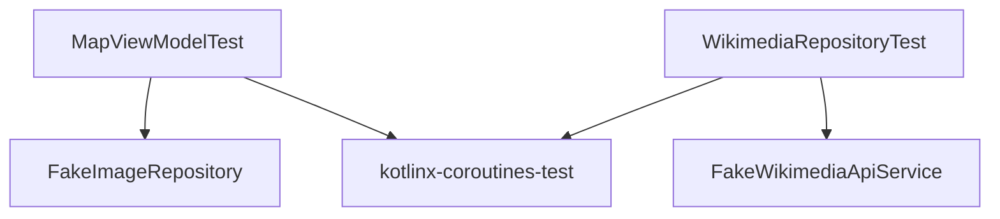

# Wikimedia Commons Map App - Architecture

## Overview

This Android project displays geotagged Wikimedia Commons images on a Mapbox map. The mobile app lets users search by term, renders returned images as map annotations, automatically fits the map to the result extent, and shows image details in a popup or full-screen result list.

The repository also contains Android Auto / Android Automotive entry points backed by the shared car-app module.

## Modules

| Module | Purpose |
|--------|---------|
| `mobile` | Phone app with Mapbox map, Wikimedia search, Compose overlays, and image details. |
| `automotive` | Android Automotive OS host entry point for the shared car app service. |
| `shared` | Shared AndroidX Car App service/session/screen code and minimum car API metadata. |

Mobile and automotive app modules own their service declarations. The `shared` manifest only declares shared metadata.

## Architecture Pattern

The mobile app follows **MVVM** with a repository boundary and small UI/map orchestration components.



## Current Package Structure

| Package / File | Responsibility |
|----------------|----------------|
| `MainActivity` | Initializes services, owns `MapView`, wires UI callbacks, handles camera movement, and clears map annotations on destroy. |
| `map/ImageAnnotationController` | Owns Mapbox `PointAnnotationManager`, marker creation, diff-based sync, click handling, and annotation cleanup. |
| `presentation/MapViewModel` | Owns `MapUiState`, search/load-more orchestration, selection state, errors, and fit-bounds requests. |
| `presentation/MapViewModelFactory` | Creates `MapViewModel` with an `ImageRepository`. |
| `presentation/components/*` | Compose overlays: search bar, action buttons, popup, image list, and thumbnails. |
| `domain/model/*` | `WikiImage` and `PagedResult` domain models. |
| `domain/repository/ImageRepository` | Search contract used by the ViewModel. |
| `data/repository/WikimediaRepository` | Calls the API and maps/filter Wikimedia pages into geotagged `WikiImage` objects. |
| `data/remote/*` | Retrofit API, HTTP config, and serializable Wikimedia response models. |
| `di/ServiceLocator` | Builds Retrofit/OkHttp and exposes the repository instance. |

## Key Runtime Flows

### Search Flow



Search success increments `fitBoundsRequestId`. `MainActivity` observes that id with `LaunchedEffect` and fits the camera to all returned annotations. `loadMore()` appends results but does not increment this id, so it does not unexpectedly move the map while the user is browsing.

### Annotation Click Flow



### List Selection Flow



### Pagination Flow



## Design Decisions

### 1. Activity Owns Map Camera, Not UI Rendering

`MainActivity` owns the Android `MapView` and camera operations (`zoomToImage`, `zoomToFit`). Compose components stay platform-light and communicate through callbacks.

### 2. Annotation Logic Is Isolated

`ImageAnnotationController` keeps Mapbox annotation code out of the activity and Compose layer. It maintains:

- `annotationsByImageId` for incremental create/delete behavior.
- `imagesById` for click lookup.
- A single `PointAnnotationManager` lifecycle with explicit `clear()`.

### 3. Explicit Fit-Bounds Request

`MapUiState.fitBoundsRequestId` is an event-like counter. It avoids deriving camera movement from every image-list change and gives the ViewModel clear control over when the map should fit all annotations.

### 4. UI Split Into Focused Composables

Compose UI lives under `presentation/components`:

- `MainScreen` composes the screen and dialogs.
- `SearchBar` owns IME search behavior and keyboard dismissal.
- `ImagePopup` displays thumbnail, title, and location metadata.
- `ImageListOverlay` shows all retrieved images and manual pagination.
- `WikimediaThumbnail` centralizes Coil image loading, fallback, and Wikimedia headers.

### 5. Wikimedia HTTP Configuration Is Centralized

`WikimediaHttpConfig.USER_AGENT` is shared by Retrofit requests and Coil thumbnail requests. This prevents duplicated User-Agent strings and keeps Wikimedia-specific HTTP policy out of UI code.

### 6. Repository Mapping Is Kept Small

`WikimediaRepository` maps API pages through private helpers:

- `Page.toWikiImage()`
- `Page.coordinate()`
- `ExtMetadata.coordinate()`

Pages without image info or coordinates are filtered out before reaching the ViewModel.

## Technology Choices

| Technology | Usage |
|------------|-------|
| Mapbox Maps SDK | Map rendering, camera movement, and point annotations. |
| Jetpack Compose | Search overlay, map controls, result list, popup, loading, and error UI. |
| Retrofit | Wikimedia Commons API client. |
| Kotlinx Serialization | Wikimedia JSON parsing with unknown-key tolerance. |
| OkHttp | Timeouts, cache, headers, and logging interceptor. |
| Coil | Thumbnail loading in Compose with Wikimedia request headers and fallback image. |
| Coroutines + StateFlow | Async search/load-more operations and reactive UI state. |
| AndroidX Car App | Shared car service/session/screen used by mobile projection and automotive entry points. |

## Testing Strategy



| Test | Coverage |
|------|----------|
| `MapViewModelTest` | Search success/empty/failure, pagination, selected image state, list visibility, fit-bounds request behavior. |
| `WikimediaRepositoryTest` | API mapping, coordinate fallback from metadata, filtering invalid pages, pagination offset, exception propagation. |

Common verification commands:

```bash
./gradlew :mobile:testDebugUnitTest --no-daemon
./gradlew :automotive:assembleDebug --no-daemon
./gradlew check --no-daemon
```

## Known Limitations & Improvements

### Current Limitations

1. Searches require network; there is no local result database.
2. Pagination is manual through a "Load More" button rather than Paging 3.
3. Thumbnails load on demand; there is no proactive prefetching.
4. Search history and suggestions are not implemented.
5. Map marker visuals still use the launcher foreground drawable rather than a domain-specific marker asset.

### Possible Improvements

1. Add Room caching for recent search results.
2. Replace manual paging with Jetpack Paging 3.
3. Prefetch thumbnails for the next result page.
4. Add search history or Wikimedia search suggestions.
5. Replace the marker drawable with a clearer photo/map pin asset.
6. Add UI tests for search, popup, and list selection flows.
