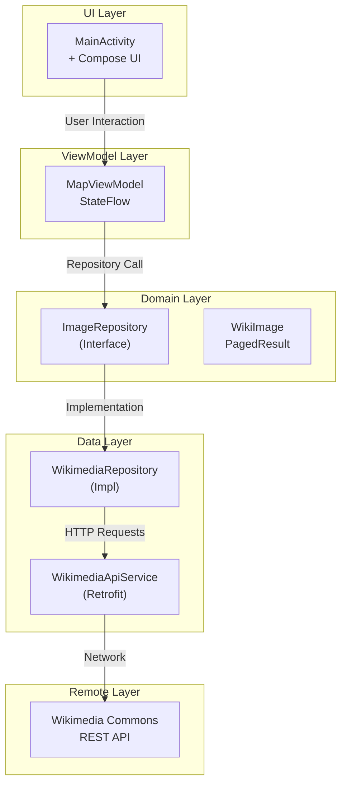
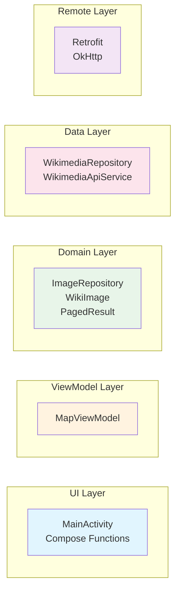
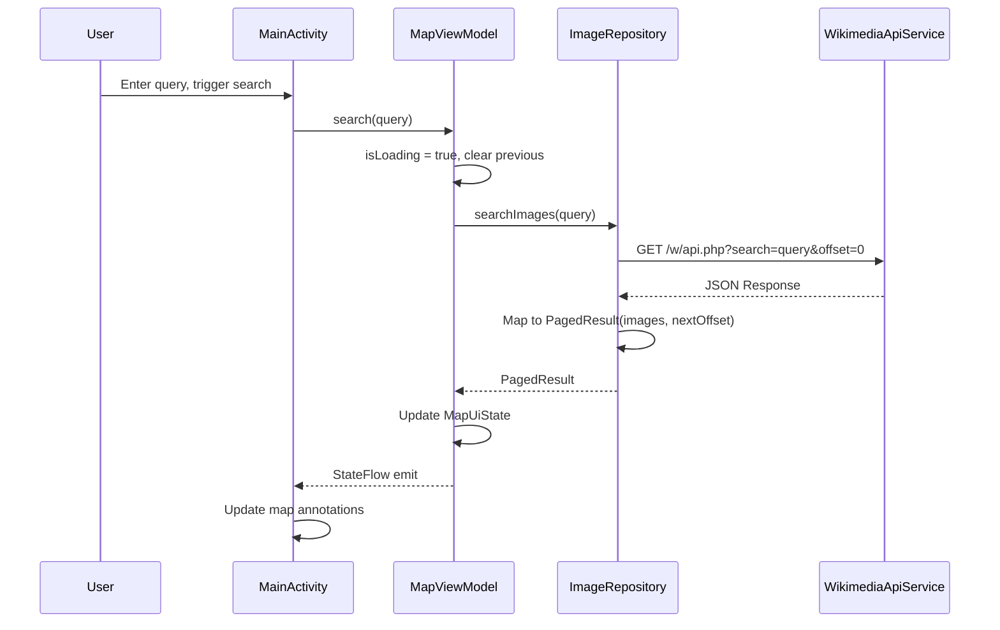
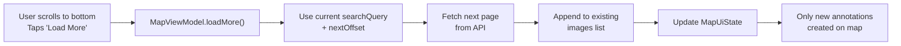
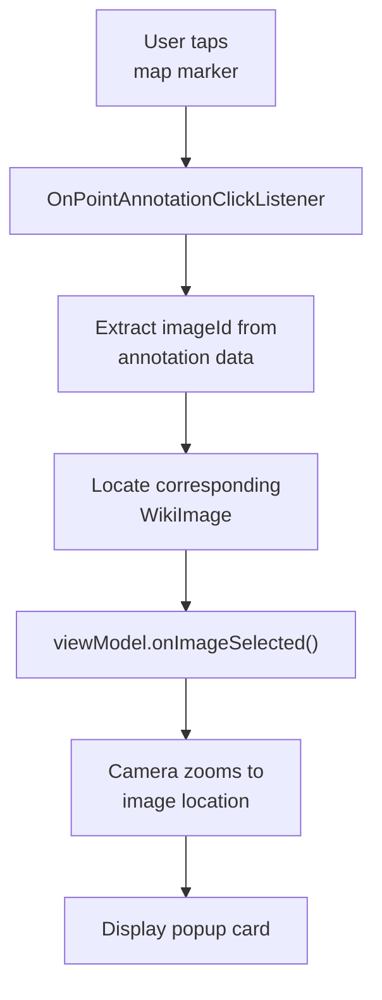
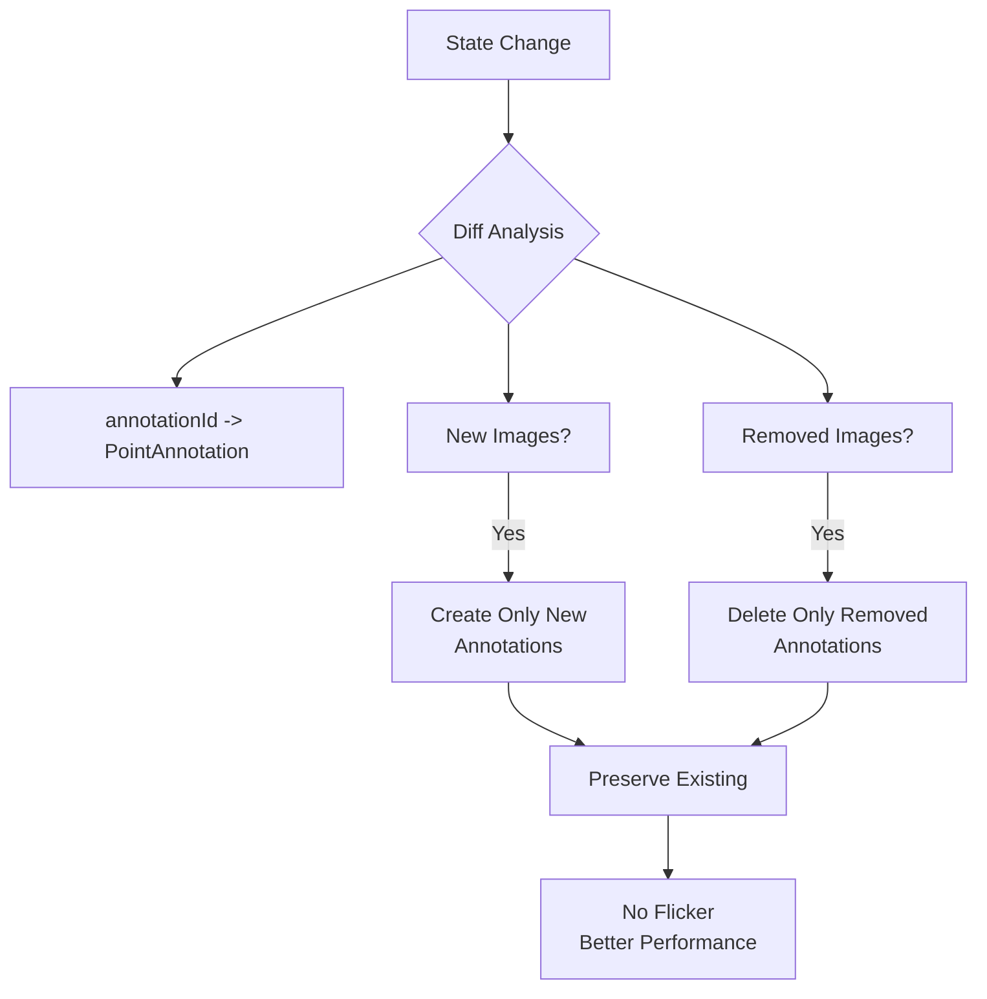
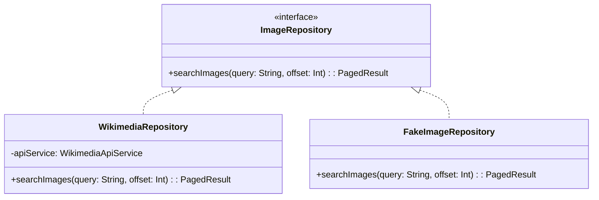
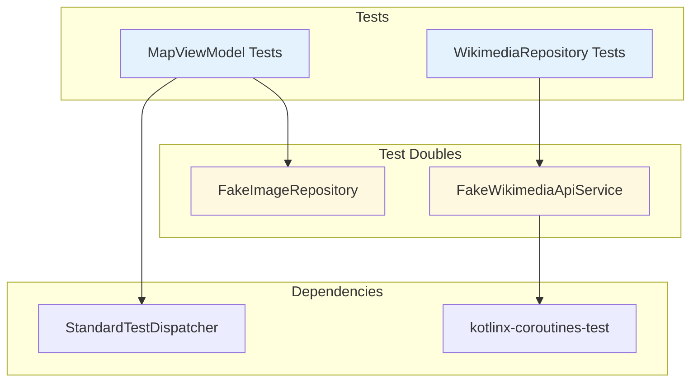

# Wikimedia Commons Map App - Architecture

## Overview

This Android application displays geotagged images from Wikimedia Commons on an interactive Mapbox map. Users can search for images, view them as map annotations, and browse results in a full-screen list.

## Architecture Pattern

### MVVM + Repository Pattern

The app follows **MVVM (Model-View-ViewModel)** with the **Repository pattern** for clean separation of concerns:

### Layer Responsibilities

| Layer | Components | Responsibility |
|-------|-----------|--------------|
| **UI** | `MainActivity`, Compose functions | Render UI, handle user interactions, sync map annotations |
| **ViewModel** | `MapViewModel` | Expose UI state via `StateFlow`, orchestrate data operations |
| **Domain** | `ImageRepository`, `WikiImage`, `PagedResult` | Define business entities and repository contracts |
| **Data** | `WikimediaRepository`, `WikimediaApiService` | Fetch and transform remote data |
| **Remote** | Retrofit, OkHttp | Network communication with Wikimedia API |

## Technology Choices

### Mapbox Maps SDK (v11.1.0)
- **Why**: Industry-leading vector map rendering, smooth gesture handling, and first-class annotation support.
- **Usage**: `MapView` with `PointAnnotationManager` for marker rendering.

### Retrofit + Kotlinx Serialization
- **Why**: Type-safe HTTP client with Kotlin-native serialization. No reflection, compact JSON parsing.
- **Usage**: `WikimediaApiService` defines API endpoints; `Json` parser configured with `ignoreUnknownKeys` for API resilience.

### Kotlin Coroutines + Flow
- **Why**: Structured concurrency, cancellation support, and reactive UI updates via `StateFlow`.
- **Usage**: `MapViewModel` exposes `MapUiState` as `StateFlow`; repository calls use `Dispatchers.IO`.

### Coil
- **Why**: Modern Kotlin-first image loading with built-in memory/disk caching and Compose integration.
- **Usage**: `AsyncImage` composables for thumbnails in list and popup cards.

### Jetpack Compose
- **Why**: Declarative UI, easy state-driven recomposition, Material Design 3 components.
- **Usage**: Search bar, image list overlay, popup card, and loading indicators.

## Data Flow

### Search Flow

### Pagination Flow

### Annotation Click Flow

## Key Design Decisions

### 1. Incremental Annotation Updates
**Decision**: Maintain `annotationId -> PointAnnotation` mapping and only create/delete changed annotations.
**Rationale**: Full rebuild on every state change causes map flicker and poor performance with large datasets. Diff-based updates preserve existing annotations and only mutate what's necessary.

### 2. PagedResult Wrapper
**Decision**: Repository returns `PagedResult(images, nextOffset)` instead of raw `List<WikiImage>`.
**Rationale**: Decouples pagination metadata from UI state. ViewModel decides how to handle `nextOffset`; the API contract is explicit.

### 3. ImageRepository Interface
**Decision**: Extract `ImageRepository` interface; `WikimediaRepository` implements it.
**Rationale**: Enables test doubles (fakes/mocks) without Robolectric or framework dependencies. ViewModel tests use `FakeImageRepository`.

### 4. OkHttp Disk Cache
**Decision**: Configure 10MB disk cache in `ServiceLocator`.
**Rationale**: Reduces redundant API calls and image downloads on configuration changes or repeat searches. Coil handles image caching automatically.

### 5. No Android Log in Repository
**Decision**: Removed `android.util.Log` calls from `WikimediaRepository`.
**Rationale**: Repositories should be framework-agnostic. Android Log breaks JVM unit tests; proper logging should use an injectable abstraction if needed.

## Testing Strategy

| Component | Approach | Coverage |
|-----------|----------|----------|
| `MapViewModel` | `FakeImageRepository` + `StandardTestDispatcher` | Search, pagination, selection, error handling |
| `WikimediaRepository` | `FakeWikimediaApiService` | Mapping, filtering, pagination, exceptions |

Tests run with `kotlinx-coroutines-test` for coroutine control and `advanceUntilIdle` for async state verification.

Run tests: `./gradlew :mobile:testDebugUnitTest`

## Known Limitations & Improvements

### Current Limitations
1. **No offline support**: Searches require active network; no local caching of results.
2. **No retry mechanism**: Network failures show error; no automatic retry with backoff.
3. **Single-page list**: Large result sets could benefit from virtualized/lazy list with proper paging.
4. **No image prefetching**: Thumbnails load on-demand; scrolling fast may show placeholders.
5. **No search history**: Users must retype queries; no saved recent searches.

### Future Improvements
1. **Room Database**: Cache search results and images for offline browsing.
2. **WorkManager + Retry**: Background sync with exponential backoff for failed requests.
3. **Pagination with Paging 3**: Replace manual pagination with Jetpack Paging for list efficiency.
4. **Image prefetching**: Prefetch next page thumbnails during scroll.
5. **Search suggestions**: Autocomplete with Wikimedia search suggestions API.
6. **Proper logging**: Introduce an injectable `Logger` interface for structured logging.
7. **Error granularity**: Distinguish network errors, server errors, and empty results with specific UI messages.
8. **Accessibility**: Add content descriptions to map annotations and image list items.
