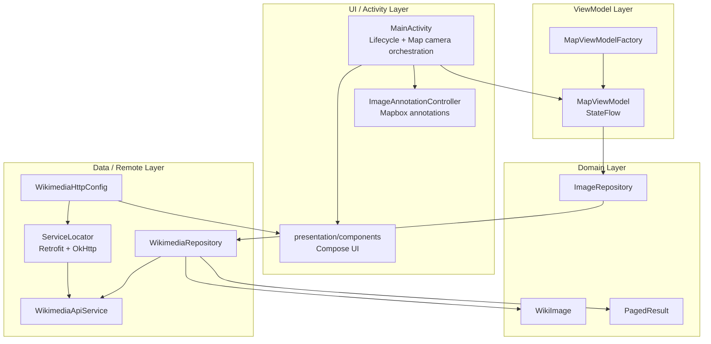
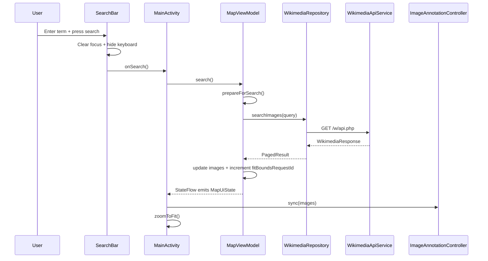
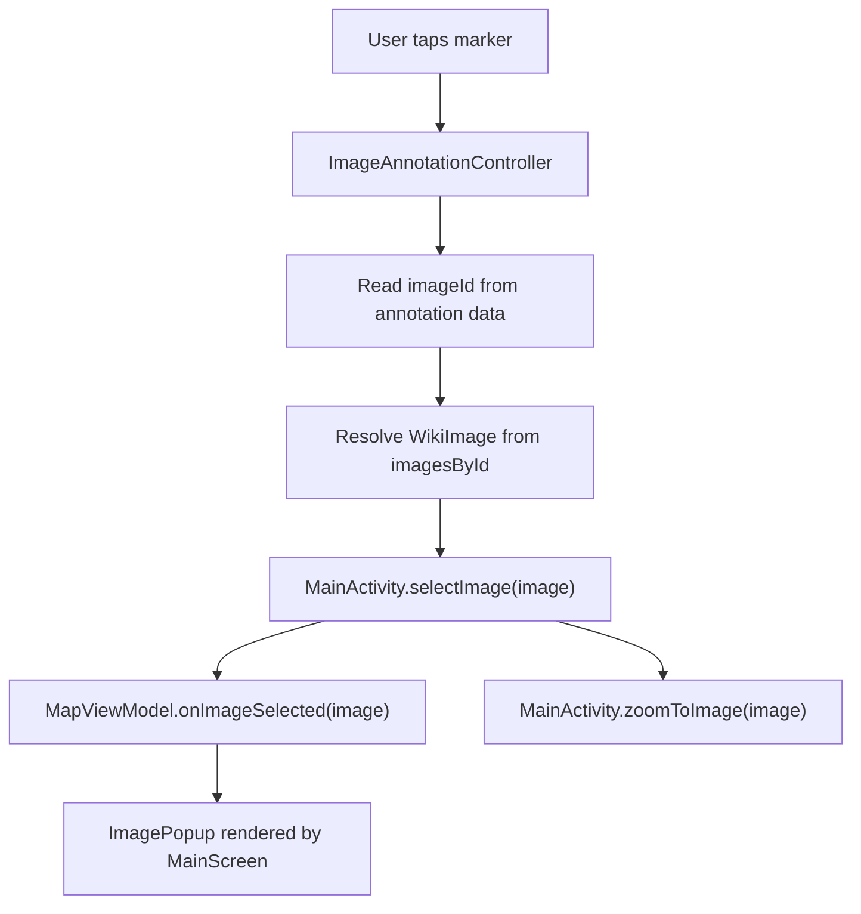
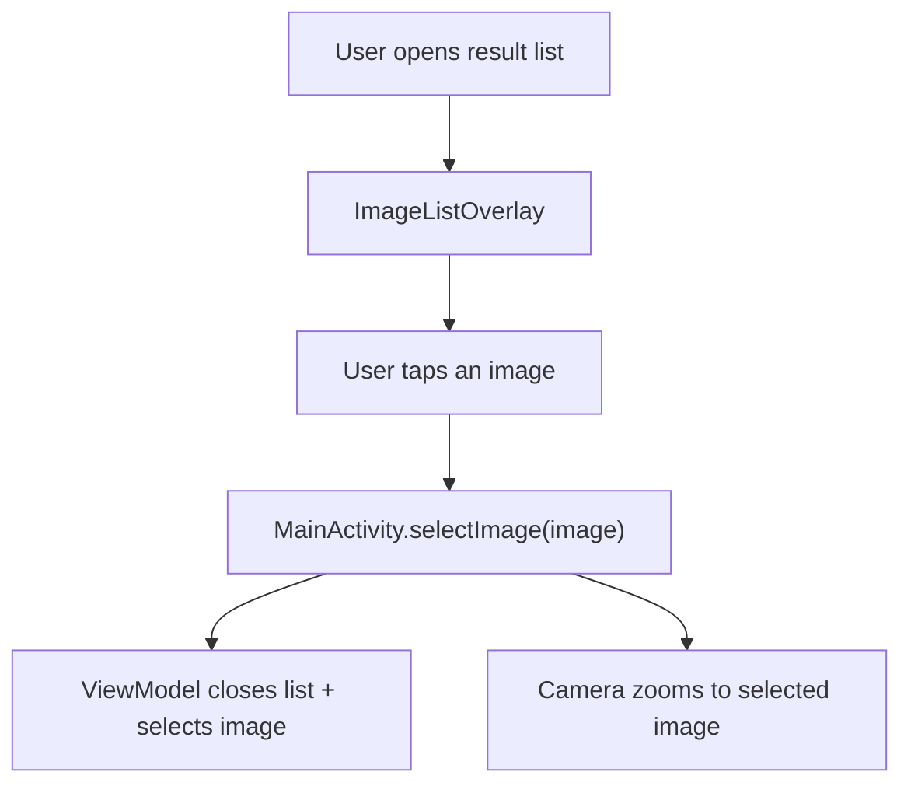
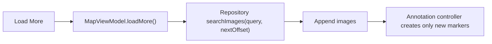
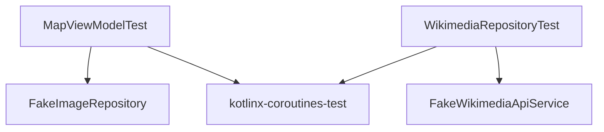

# Wikimedia Commons Map App - Architecture

**[中文版](./README_CN.md)**

## Overview

This Android project displays geotagged Wikimedia Commons images on a Mapbox map. The mobile app lets users search by term, renders returned images as map annotations, automatically fits the map to the result extent, and shows image details in a popup or full-screen result list.

The repository also contains Android Auto / Android Automotive entry points backed by the shared car-app module. This app was meant to be a companion navigator app with [mapbox-vrp-logistics PoC on Github](https://github.com/duchangyu/mapbox-vrp-logistics) and [Linkedin Post](https://www.linkedin.com/feed/update/urn:li:activity:7455266737027149824/), which I created a few days back as a learning practice of MapBox API and Navigation API, I just reused the boiler template as a starting point, so you may find the AppName is a little weried for the buesiness context, sorry about that :)  

## Business Context & Solution Framing

This app demonstrates a pattern that appears repeatedly in enterprise location intelligence deployments: combining third-party data sources with Mapbox's rendering and annotation capabilities to deliver a search-driven spatial experience.

The Wikimedia Commons use case is intentionally generic, but the architecture mirrors real-world scenarios I would encounter as a Solutions Architect — for example:

- A logistics company overlaying delivery point photos on a route map
- A real estate platform displaying property images as map annotations
- A field service app showing site photos tied to GPS coordinates

The core pattern is the same: **search → geocode → annotate → interact**. This app demonstrates that pattern end-to-end.

## Modules

- `mobile`: Phone app with Mapbox map, Wikimedia search, Compose overlays, and image details.
- `automotive`: Android Automotive OS host entry point for the shared car app service( not appliable for this case  ).
- `shared`: Shared AndroidX Car App service/session/screen code and minimum car API metadata.

Mobile and automotive app modules own their service declarations. The `shared` manifest only declares shared metadata.

## Architecture Pattern

The mobile app follows **MVVM** with a repository boundary and small UI/map orchestration components.



## Current Package Structure

- `MainActivity`: Initializes services, owns `MapView`, wires UI callbacks, handles camera movement, and clears map annotations on destroy.
- `map/ImageAnnotationController`: Owns Mapbox `PointAnnotationManager`, marker creation, diff-based sync, click handling, and annotation cleanup.
- `presentation/MapViewModel`: Owns `MapUiState`, search/load-more orchestration, selection state, errors, and fit-bounds requests.
- `presentation/MapViewModelFactory`: Creates `MapViewModel` with an `ImageRepository`.
- `presentation/components/*`: Compose overlays: search bar, action buttons, popup, image list, and thumbnails.
- `domain/model/*`: `WikiImage` and `PagedResult` domain models.
- `domain/repository/ImageRepository`: Search contract used by the ViewModel.
- `data/repository/WikimediaRepository`: Calls the API and maps/filter Wikimedia pages into geotagged `WikiImage` objects.
- `data/remote/*`: Retrofit API, HTTP config, and serializable Wikimedia response models.
- `di/ServiceLocator`: Builds Retrofit/OkHttp and exposes the repository instance.

## Key Runtime Flows

### Search Flow



Search success increments `fitBoundsRequestId`. `MainActivity` observes that id with `LaunchedEffect` and fits the camera to all returned annotations. `loadMore()` appends results but does not increment this id, so it does not unexpectedly move the map while the user is browsing.

### Annotation Click Flow



### List Selection Flow



### Pagination Flow



## Design Decisions

### 1. Activity Owns Map Camera, Not UI Rendering

`MainActivity` owns the Android `MapView` and camera operations (`zoomToImage`, `zoomToFit`). Compose components stay platform-light and communicate through callbacks.

### 2. Annotation Logic Is Isolated

`ImageAnnotationController` keeps Mapbox annotation code out of the activity and Compose layer. It maintains:

- `annotationsByImageId` for incremental create/delete behavior.
- `imagesById` for click lookup.
- A single `PointAnnotationManager` lifecycle with explicit `clear()`.

### 3. Explicit Fit-Bounds Request

`MapUiState.fitBoundsRequestId` is an event-like counter. It avoids deriving camera movement from every image-list change and gives the ViewModel clear control over when the map should fit all annotations.

### 4. UI Split Into Focused Composables

Compose UI lives under `presentation/components`:

- `MainScreen` composes the screen and dialogs.
- `SearchBar` owns IME search behavior and keyboard dismissal.
- `ImagePopup` displays thumbnail, title, and location metadata.
- `ImageListOverlay` shows all retrieved images and manual pagination.
- `WikimediaThumbnail` centralizes Coil image loading, fallback, and Wikimedia headers.

### 5. Wikimedia HTTP Configuration Is Centralized

`WikimediaHttpConfig.BASE_URL` and `WikimediaHttpConfig.USER_AGENT` are shared by Retrofit requests and Coil thumbnail requests. This prevents duplicated base URL and User-Agent strings and keeps Wikimedia-specific HTTP policy out of UI code.

### 6. Repository Mapping Is Kept Small

`WikimediaRepository` maps API pages through private helpers:

- `Page.toWikiImage()`
- `Page.coordinate()`
- `ExtMetadata.coordinate()`

Pages without coordinates are filtered out before reaching the ViewModel.

### 7. Scope Boundaries — What I Deliberately Left Out

As a Solutions Architect, knowing what **not** to build is as important as knowing what to build. For this assignment I made explicit scope decisions:

- **No backend / proxy layer**: The Wikimedia API is public. In a production enterprise deployment, the third-party API could be proprietary, a backend proxy is necessory to handle auth, rate limiting, and caching.
- **No offline caching**: A local DB and [MapBox offline maps](https://docs.mapbox.com/android/maps/guides/offline/) would improve UX but adds complexity disproportionate to the demo goal. I documented this as a known improvement.
- **Mock data not used**: I used the live Wikimedia API throughout — real network conditions surface real performance trade-offs.
- **Android only**: Per assignment scope and for simplicity, Andoid is more popular in China market. A production deployment would use Mapbox's cross-platform SDKs (Flutter or React Native) to reduce duplicate codebases across iOS/Android.

## Technology Choices

- **Mapbox Maps SDK**: Map rendering, camera movement, and point annotations.
- **Jetpack Compose**: Search overlay, map controls, result list, popup, loading, and error UI.
- **Retrofit**: Wikimedia Commons API client.
- **Kotlinx Serialization**: Wikimedia JSON parsing with unknown-key tolerance.
- **OkHttp**: Timeouts, cache, headers, and logging interceptor.
- **Coil**: Thumbnail loading in Compose with Wikimedia request headers and fallback image.


## Testing Strategy



- `MapViewModelTest`: Search success/empty/failure, pagination, selected image state, list visibility, fit-bounds request behavior.
- `WikimediaRepositoryTest`: API mapping, coordinate fallback from metadata, filtering invalid pages, pagination offset, exception propagation.

Common verification commands:

```bash
./gradlew :mobile:testDebugUnitTest --no-daemon
./gradlew :automotive:assembleDebug --no-daemon
./gradlew check --no-daemon
```

## Performance & Scale Analysis

### Memory
Annotations are managed through `ImageAnnotationController` with diff-based sync — only new annotations are created, existing ones are reused. This avoids O(n) recreation on every state update.

**At scale**: For result sets >500 images, I would implement clustering using Mapbox's clustering API, grouping nearby annotations into a single cluster marker. This is the standard pattern for enterprise deployments with dense data sets.  ([Document Examples here](https://docs.mapbox.com/android/maps/examples/android-view/add-cluster-symbol-annotations/)) 

### Battery
In this case, network calls use OkHttp with timeout configuration. The app does not poll or maintain persistent connections — all requests are user-initiated. Background battery impact is minimal.

**At scale**: For real-time tracking use cases (e.g. live delivery tracking), I would implement exponential backoff and configurable polling intervals as a battery-friendly alternative to persistent WebSocket connections, giving the customer control over battery/freshness trade-offs. Generally speaking, persistent WebSocket connection is not necessory except for some specific scenarios which really need *real-time* feedback. 

### Network Efficiency
Wikimedia thumbnails are loaded on-demand via Coil with in-memory caching. The `WikimediaHttpConfig.BASE_URL` and `WikimediaHttpConfig.USER_AGENT` are centralized to prevent header duplication across Retrofit and Coil.

**At scale**: I would add Jetpack Paging 3 to replace manual pagination, and pre-fetch thumbnails for the next page while the user browses the current one.

### Large Result Sets
`loadMore()` appends results without triggering `fitBoundsRequestId` increment — the map does not re-zoom while the user is browsing. This is an intentional UX decision: fit-to-bounds only triggers on new searches.

**At scale**: Beyond ~200 annotations, I would switch to a viewport-culling strategy — only rendering annotations visible in the current map bounds, loading more as the user pans.

## If I Had More Time — Prioritized Improvements

These are ordered by the impact they would have in a **production enterprise deployment**, not just demo polish:

**1. Mapbox annotation clustering** — Essential for dense datasets; prevents annotation overlap and performance degradation.

**2. Jetpack Paging 3** — Removes manual pagination logic; handles back-pressure automatically.

**3. Room caching for recent searches** — Provides offline resilience; critical for field service use cases.

**4. MapBox offline maps for limited connections** - This is especially useful for users who are traveling in areas with limited or no connectivity,

**5. Viewport culling for large result sets** — Required for >500 annotation scenarios.

**6. UI tests for search/popup/list flows** — Needed before handing off to a customer's engineering team.

**7. Custom marker assets** — Brand consistency(firstly replacing the android icon for annotation); every enterprise customer will ask for this.

**8. China Market Localization & Regulatory Alignment** — 
For enterprise customers deploying in China, localization goes beyond code changes — it involves regulatory constraints that must be understood before any architecture decision is made.

## SA Consideration for China Market Localization & Regulatory Alignment

Since this part is really important for a business success, so I put it into a seperate section. China market is complecated, especially for GIS industry in strong regulartory enviroment, We need to get more understanding of customer's business and context before providing technical suggestions.


**SA diagnostic — Get customer's context before any architecture decision:**

Frankly, China localization is complex — not primarily because of technical difficulty, but because regulatory constraints directly shape which technical options are even available. Before drawing any architecture diagram, I would ask the customer following questions.

First: where are your end users — mainland China, overseas, or both? This determines the tile source and compliance strategy. Pure overseas means standard Mapbox. Pure domestic may require a hybrid architecture. Cross-border requires a dual-stack approach.

Second: what coordinate system is your data in — raw GPS or sourced from a domestic map provider? Raw WGS-84 data integrates directly with Mapbox. GCJ-02 data requires a conversion layer, and getting this wrong means every annotation lands in the wrong location.

Third: do you have hard compliance requirements on the base map — government project, automotive-grade, surveying license? Hard compliance means the standard Mapbox tile set may not be viable and a NASMG-approved base map is required. Soft compliance opens up proxy or hybrid options.

For Mapbox's target enterprise customers — particularly those pursuing overseas expansion — the regulatory burden is significantly lower, as the primary use case is serving international end users. That said, even export-focused customers often have mixed fleets or domestic operations that make these questions worth asking early. The goal is to surface constraints in discovery, not six months into implementation.

**Technical considerations:**
- **Map tile routing**: Use standart Mapbox tile endpoints or hybrid architecture to comply with data localization requirements according to customer's business neeed. 
- **Coordinate system**: Use WGS-84 by default or a coordinates conversion layer according to the data context.
- **Network resilience**: Wikimedia API access is not stable in China; a backend proxy with domestic CDN fallback would be required for production reliability.
- **Image hosting**: Wikimedia thumbnail URLs may not resolve reliably; a cached proxy layer would be needed.
- **UI i18n**: String externalization with zh-CN locale variants; font rendering on Chinese OEM devices (Xiaomi, OPPO, Vivo); Chinese IME pinyin composition event handling in the search input, etc.

## SA Reflection

This demo app is fundamentally a **pre-sales motion compressed into a single deliverable**:

1. **Discovery**: I read the requirements and identified the core pattern (search → spatial → interact) before writing a line of code.

1. **Architecture design**: MVVM with clear layer separation means a customer's engineering team can extend this without touching the Mapbox integration layer.

2. **Trade-off documentation**: Every shortcut I took is documented with the production alternative. This is what I would give a customer after a PoC — not just "here's what I built" but "here's what we'd need to improve for production."

3. **Honesty about limitations**: The Prioritized Improvements section is not a list of failures — it's a roadmap for the next conversation with the customer's engineering team.


In a real customer engagement, this README would be the artifact that gets shared with the CTO after the demo. The code proves technical credibility. The document drives the next conversation.
