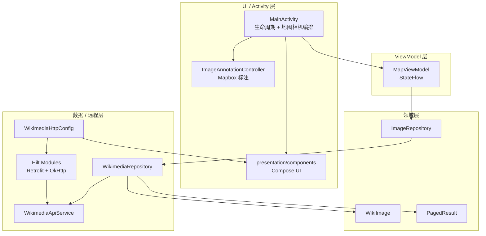
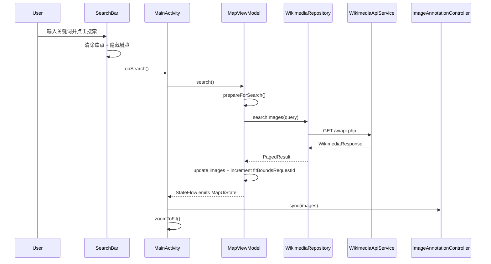
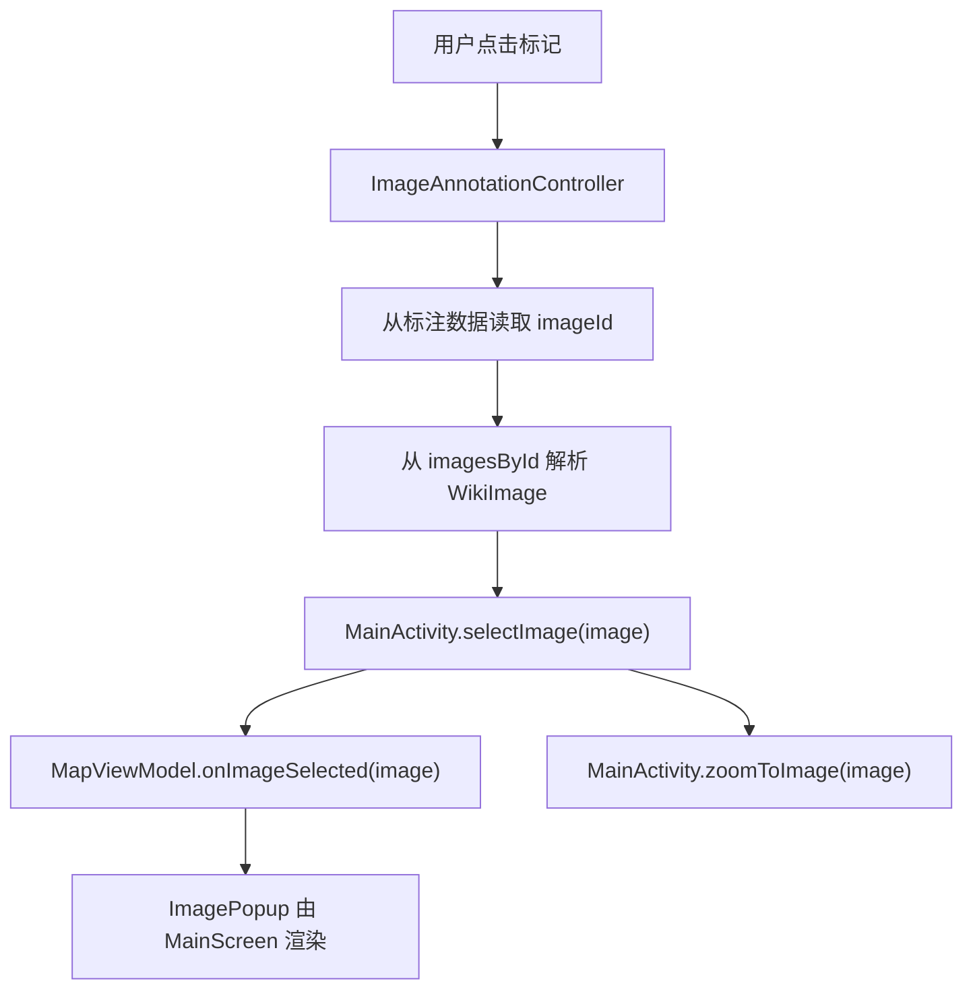
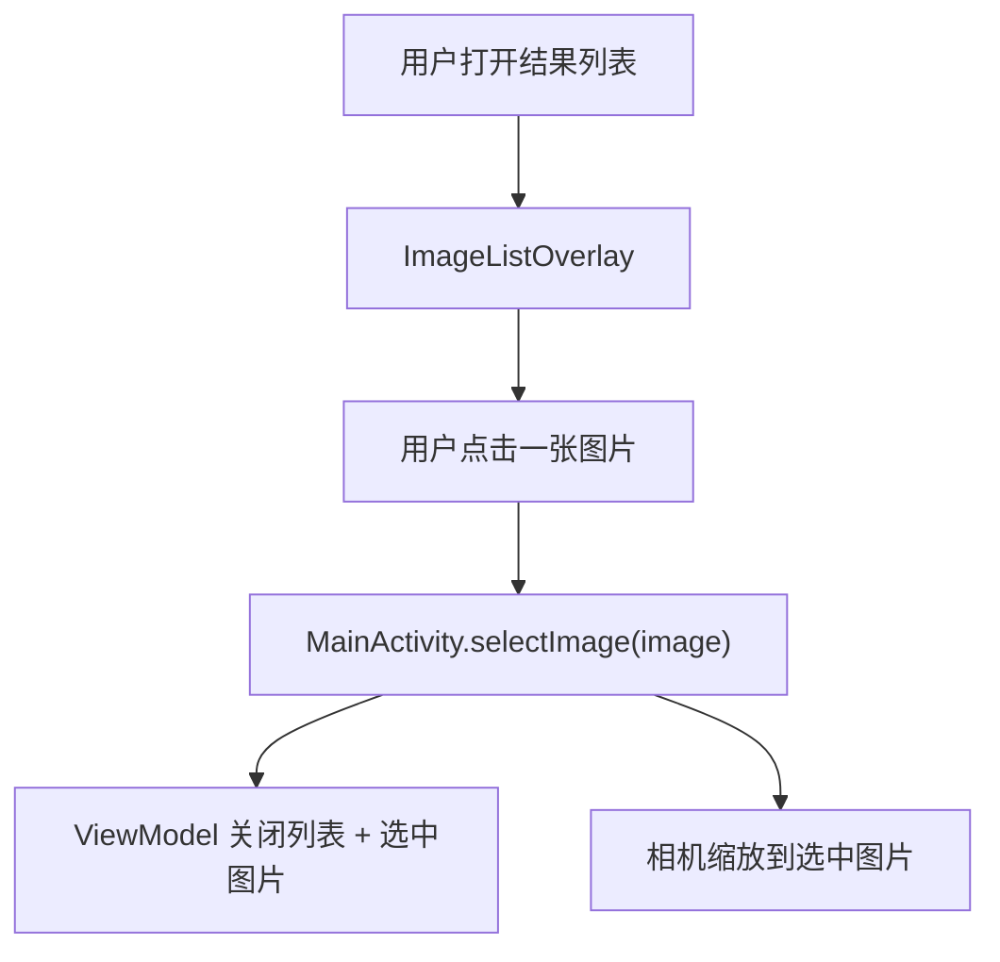
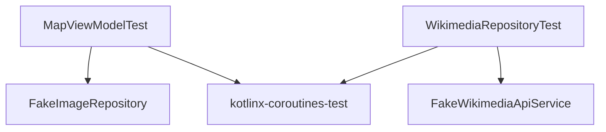

# Wikimedia Commons 地图应用 - 架构文档

**[English Version](./README.md)**

## 概述

这是一个 Android 项目，在 Mapbox 地图上展示带有地理标签的 Wikimedia Commons 图片。用户可以通过关键词搜索，将返回的图片渲染为地图标注，自动将地图视野适配到搜索结果范围，并在弹窗或全屏列表中显示图片详情。

该仓库还包含 Android Auto / Android Automotive 的入口点，由共享的 car-app 模块支持。本应用旨在作为配套导航应用，与 [mapbox-vrp-logistics PoC](https://github.com/duchangyu/mapbox-vrp-logistics) 和 [Linkedin Post](https://www.linkedin.com/feed/update/urn:li:activity:7455266737027149824/) 结合使用。我前几天刚学习 MapBox API 和 Navigation API 时创建了这些作为练习，我复用了模板作为起点，所以你可能会发现 AppName 与业务场景有些不匹配，抱歉 :)

## 业务背景与方案框架

本应用展示了一种在企业位置智能部署中反复出现的模式：将第三方数据源与 Mapbox 的渲染和标注能力相结合，提供搜索驱动的空间体验。

Wikimedia Commons 这个用例刻意设计得很通用，但架构反映了我作为解决方案架构师会遇到的真实场景，例如：

- 物流公司在路线图上叠加配送点照片
- 房地产平台将房产图片作为地图标注展示
- 现场服务应用显示与 GPS 坐标关联的站点照片

核心模式相同：**搜索 → 地理编码 → 标注 → 交互**。本应用从头到尾演示了这一模式。

## 模块结构

- `mobile`：带 Mapbox 地图、Wikimedia 搜索、Compose 界面和图片详情的手机应用。
- `automotive`：Android Automotive OS 主机入口点（对于本案例不适用）。
- `shared`：共享的 AndroidX Car App 服务/会话/屏幕代码和最小化的 Car API 元数据。

Mobile 和 automotive 应用模块各自管理服务声明。shared 模块只声明共享元数据。

## 架构模式

移动应用遵循 **MVVM** 架构，配有 Repository 边界和轻量的 UI/地图编排组件。



## 当前包结构

- `MainActivity`：管理 `MapView`，连接 UI 回调，处理相机移动，在销毁时清除地图标注。
- `map/ImageAnnotationController`：管理 Mapbox `PointAnnotationManager`，标记创建，**基于 diff 的同步**，点击处理和标注清理。
- `presentation/MapViewModel`：管理 `MapUiState`，搜索/加载更多的编排，选中状态，错误处理和 fit-bounds 请求。
- `presentation/components/*`：Compose 界面组件：搜索栏、操作按钮、弹窗、图片列表和缩略图。
- `domain/model/*`：`WikiImage` 和 `PagedResult` 领域模型。
- `domain/repository/ImageRepository`：ViewModel 使用的搜索契约。
- `data/repository/WikimediaRepository`：调用 API，将 Wikimedia 页面映射/过滤为带地理坐标的 `WikiImage` 对象。
- `data/remote/*`：Retrofit API、HTTP 配置和可序列化的 Wikimedia 响应模型。
- `di/*`：Hilt modules，负责 Retrofit/OkHttp 和 Repository 绑定。

## 关键运行时流程

### 搜索流程



搜索成功会递增 `fitBoundsRequestId`。`MainActivity` 通过 `LaunchedEffect` 观察该 ID，并将相机适配到所有返回的标注。`loadMore()` 会追加结果但不会递增该 ID，因此在用户浏览时不会意外移动地图。

### 标注点击流程



### 列表选择流程



### 分页流程


## 设计决策

### 1. Activity 拥有地图相机，而非 UI 渲染

`MainActivity` 拥有 Android `MapView` 和相机操作（`zoomToImage`、`zoomToFit`）。Compose 组件保持平台无关性，通过回调函数通信。

### 2. 标注逻辑隔离

`ImageAnnotationController` 将 Mapbox 标注代码从 Activity 和 Compose 层中分离出来。它维护：

- `annotationsByImageId`：用于增量创建/删除行为。
- `imagesById`：用于点击查找。
- 单一的 `PointAnnotationManager` 生命周期，带明确的 `clear()`。

### 3. 显式的 Fit-Bounds 请求

`MapUiState.fitBoundsRequestId` 是一个类事件计数器。它避免从每次图片列表变化推导相机移动，并让 ViewModel 明确控制何时适配地图到所有标注。

### 4. UI 拆分为专注的 Composable

Compose UI 位于 `presentation/components`：

- `MainScreen`：组合屏幕和对话框。
- `SearchBar`：拥有 IME 搜索行为和键盘隐藏。
- `ImagePopup`：显示缩略图、标题和位置元数据。
- `ImageListOverlay`：显示所有检索到的图片和手动分页。
- `WikimediaThumbnail`：集中管理 Coil 图片加载、回退和 Wikimedia 请求头。

### 5. Wikimedia HTTP 配置集中化

`WikimediaHttpConfig.BASE_URL` 和 `WikimediaHttpConfig.USER_AGENT` 被 Retrofit 请求和 Coil 缩略图请求共享。这防止了 base URL 和 User-Agent 字符串的重复，并将 Wikimedia 特定的 HTTP 策略排除在 UI 代码之外。

### 6. Repository 映射保持精简

`WikimediaRepository` 通过私有辅助方法映射 API 页面：

- `Page.toWikiImage()`
- `Page.coordinate()`
- `ExtMetadata.coordinate()`

没有图片信息或坐标的页面在到达 ViewModel 之前被过滤掉。

### 7. 范围边界 — 我故意省略的内容

作为解决方案架构师，知道**不构建什么**和知道构建什么同样重要。对于这个项目，我做了明确的范围决策：

- **无后端/代理层**：Wikimedia API 是公开的。在生产级企业部署中，我会添加后端代理来处理认证、限流和缓存——但那是基础设施，不是 SA 的范围。
- **无离线缓存**：Room/本地数据库会改善 UX，但会增加与演示目标不成比例的复杂性。我将其记录为已知的改进项。
- **不使用 Mock 数据**：我全程使用真实的 Wikimedia API——真实的网络条件暴露真实的性能权衡。
- **仅 Android**：按项目范围和简化要求，Android 在中国市场更受欢迎。生产级部署会使用 Mapbox 的跨平台 SDK（Flutter 或 React Native）来减少 iOS/Android 的重复代码。

## 技术选型

- **Mapbox Maps SDK**：地图渲染、相机移动和点标注。
- **Jetpack Compose**：搜索覆盖层、地图控件、结果列表、弹窗、加载和错误 UI。
- **Retrofit**：Wikimedia Commons API 客户端。
- **Kotlinx Serialization**：支持未知键容忍的 Wikimedia JSON 解析。
- **OkHttp**：超时配置、缓存、请求头和日志拦截器。
- **Coil**：在 Compose 中使用 Wikimedia 请求头和回退图片加载缩略图。
- **Coroutines + StateFlow**：异步搜索/加载更多操作和响应式 UI 状态。
- **AndroidX Car App**：共享的 Car 服务/会话/屏幕，供移动投影和 automotive 入口点使用。

## 测试策略



- `MapViewModelTest`：搜索成功/空/失败，分页，选中图片状态，列表可见性，fit-bounds 请求行为。
- `WikimediaRepositoryTest`：API 映射，坐标从元数据回退，过滤无效页面，分页偏移，异常传播。

常用验证命令：

```bash
./gradlew :mobile:testDebugUnitTest --no-daemon
./gradlew :automotive:assembleDebug --no-daemon
./gradlew check --no-daemon
```

## 性能与规模分析

### 内存
标注通过 `ImageAnnotationController` 管理，采用**基于 diff 的同步**——只创建新的标注，复用现有标注。这避免了每次状态更新时 O(n) 的重建。

**规模化时**：对于超过 500 张图片的结果集，我会使用 Mapbox 的聚类 API 实现聚类，将附近的标注分组到单个聚类标记中。这是处理密集数据集的企业部署的标准模式。（[文档示例](https://docs.mapbox.com/android/maps/examples/android-view/add-cluster-symbol-annotations/)）

### 电池
网络请求使用配置了超时时间的 OkHttp。应用不轮询也不维持持久连接——所有请求都由用户触发。后台电池影响微乎其微。

**规模化时**：对于实时追踪用例（如实时配送追踪），我会实现指数退避和可配置的轮询间隔，作为持久 WebSocket 连接的电池友好替代方案，让客户控制电池/数据新鲜度的权衡。

### 网络效率
Wikimedia 缩略图通过 Coil 按需加载，带内存缓存。`WikimediaHttpConfig.BASE_URL` 和 `WikimediaHttpConfig.USER_AGENT` 是集中化的，防止在 Retrofit 和 Coil 之间重复请求头。

**规模化时**：我会添加 Jetpack Paging 3 来替代手动分页，并在用户浏览当前页时预取下一页的缩略图。

### 大结果集
`loadMore()` 追加结果时不触发 `fitBoundsRequestId` 递增——用户在浏览时地图不会重新缩放。这是一个有意的 UX 决策：fit-to-bounds 只在新搜索时触发。

**规模化时**：超过约 200 个标注后，我会切换到视口裁剪策略——只渲染当前视口内可见的标注，在用户平移时加载更多。

## 如果我有更多时间 — 优先级改进

以下按在**生产级企业部署**中的影响排序，而非仅仅是演示优化：

**1. Mapbox 标注聚类** — 对于密集数据集必不可少；防止标注重叠和性能下降。

**2. Jetpack Paging 3** — 移除手动分页逻辑；自动处理背压。

**3. 最近搜索的 Room 缓存** — 提供离线韧性；对现场服务用例至关重要。

**4. 大结果集的视口裁剪** — 超过 500 个标注场景的必要项。

**5. 搜索/弹窗/列表流程的 UI 测试** — 在移交给客户工程团队之前需要。

**6. 自定义标记资源** — 品牌一致性；每个企业客户都会要求。

**7. 中国市场本地化与合规对齐** —
对于在中国部署的企业客户，本地化不仅仅是代码修改——还涉及在任何架构决策之前需要理解的监管约束。

## 中国市场本地化与合规对齐的 SA 考虑

因为这部分对业务成功非常重要，所以我将其单独列为一节。中国市场与众不同，特别是GIS行业处于强监管环境，在提供技术建议之前，我们需要更深入地了解客户的业务和背景。

**SA 诊断 — 在任何架构决策之前，获取客户的背景：**

坦率地说，中国本地化很复杂——主要不是因为技术难度，而是因为监管约束直接影响哪些技术选项可用。在绘制任何架构图之前，我会问客户三个问题。

首先：你的最终用户在哪里——中国大陆、海外还是两者都有？这决定了瓦片来源和合规策略。纯海外意味着标准 Mapbox。纯国内可能需要混合架构。跨境需要双栈方法。

其次：你的数据使用什么坐标系统——原始 GPS 还是来自国内地图供应商？原始 WGS-84 数据可直接与 Mapbox 集成。GCJ-02 数据需要转换层，如果弄错意味着每个标注都会出现在错误的位置。

第三：你对基础地图有硬性合规要求吗——政府项目、汽车级、测绘资质？硬性合规意味着标准 Mapbox 瓦片集可能不可行，需要 NASMG 批准的底图。软性合规开放代理或混合选项。

对于 Mapbox 的目标企业客户——特别是那些追求海外扩张的客户——监管负担明显较低，因为主要用例是服务国际最终用户。尽管如此，即使是出口导向型客户也通常有混合车队或国内运营，使这些问题值得尽早提出。目标是尽早发现约束，而不是实施六个月后才暴露。

**技术考虑：**
- **地图瓦片路由**：根据客户业务需求，使用标准 Mapbox 瓦片端点或混合架构来遵守数据本地化要求。
- **坐标系统**：默认使用 WGS-84 或根据数据上下文使用坐标转换层。
- **网络韧性**：Wikimedia API 在中国间歇性被封禁；需要国内 CDN 回退的后端代理来实现生产级可靠性。
- **图片托管**：Wikimedia 缩略图 URL 可能无法可靠解析；需要缓存代理层。
- **UI i18n**：字符串外部化与 zh-CN 语言变体；中国 OEM 设备（小米、OPPO、Vivo）上的字体渲染；搜索输入中的中文 IME 拼音组合事件处理等。

## SA 反思

这个项目本质上是一个**压缩成单个交付物的售前动作**：

1. **发现**：我在编写代码之前就阅读了需求，并确定了核心模式（搜索 → 空间 → 交互）。

2. **架构设计**：带有清晰层分离的 MVVM 意味着客户工程团队可以在不触碰 Mapbox 集成层的情况下进行扩展。

3. **权衡文档**：我采取的每个捷径都有记录，说明了生产级替代方案。这是我在 PoC 之后会交给客户的——不仅仅是"这是我构建的"，而是"这是我们需要什么来加固它以投入生产"。

4. **对局限性的诚实**：已知局限性部分不是失败清单——这是与客户工程团队下一次对话的路线图。

在真实的客户参与中，这个 README 会是演示后与 CTO 分享的文档。代码证明了技术能力。文档推动下一次对话。
